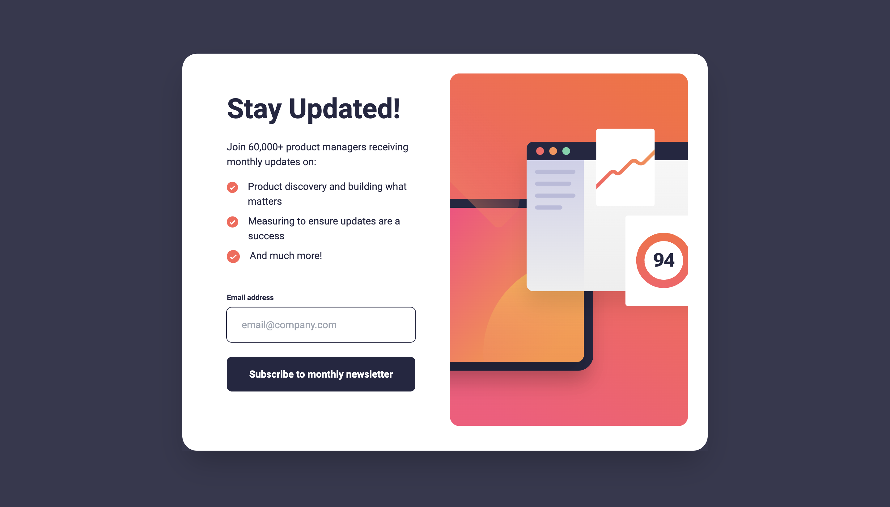

# Frontend Mentor - Newsletter sign-up form with success message solution

### Screenshot



This is a solution to the [Newsletter sign-up form with success message challenge on Frontend Mentor](https://www.frontendmentor.io/challenges/newsletter-signup-form-with-success-message-3FC1AZbNrv). Frontend Mentor challenges help you improve your coding skills by building realistic projects. 

## Table of contents

- [Overview](#overview)
  - [The challenge](#the-challenge)
  - [Links](#links)
- [My process](#my-process)
  - [Built with](#built-with)
  - [What I learned](#what-i-learned)
- [Author](#author)

## Overview

### The challenge

Users should be able to:

- Add their email and submit the form
- See a success message with their email after successfully submitting the form
- See form validation messages if:
  - The field is left empty
  - The email address is not formatted correctly
- View the optimal layout for the interface depending on their device's screen size
- See hover and focus states for all interactive elements on the page

### Links

- Solution URL: https://www.frontendmentor.io/solutions/news-letter-signup-form-using-tailwindcss-3dQh14DrOz
- Live Site URL: https://news-letter-signup-form-3l9o9qhps-gavinitp.vercel.app/

## My process

### Built with

- Mobile-first workflow
- Next.js - React framework
- Tailwindcss - For styles
- Typescript - For Type Checking
- Zod & React Hook Form - Form validation

### What I learned

First, I learned to set up the NextJS project with TypeScript and Tailwind CSS.
It's easy to extend things to use in projects, but I spent a bit of time learning how to set up font family in NextJS projects.

```js
/** @type {import('tailwindcss').Config} */
module.exports = {
  content: [
    "./pages/**/*.{js,ts,jsx,tsx,mdx}",
    "./components/**/*.{js,ts,jsx,tsx,mdx}",
    "./app/**/*.{js,ts,jsx,tsx,mdx}",
  ],
  theme: {
    extend: {
      fontFamily: {
        sans: ["var(--font-roboto)"],
      },
      colors: {
        transparent: "transparent",
        current: "currentColor",
        primary: "hsl(4, 100%, 67%)",
        slate: "hsl(234, 29%, 20%)",
        charcoal: "hsl(235, 18%, 26%)",
        grey: "hsl(231, 7%, 60%)",
        white: "hsl(0, 0%, 100%)",
      },
    },
  },
};

```

Also, I learned about Zod and React Hook Form for form validation. I would like to learn more about it in the future.

```js
const schema = z.object({
  email: z
    .string()
    .email({ message: "Valid email required" })
    .trim()
    .min(3)
    .max(30),
});

type Email = z.infer<typeof schema>;
```
Lastly, this is my first time implementing the useContext hook in a real project. (but still struggle with typescript).

```js
import { createContext, useState } from "react";

export interface EmailContextProps {
  email: string | null;
  setEmail: (email: React.SetStateAction<string | null>) => void;
}

export const EmailContext = createContext<EmailContextProps | null>(null);

export const EmailContextProvider: React.FC<{ children: React.ReactNode }> = ({
  children,
}) => {
  const [email, setEmail] = useState<string | null>(null);

  return (
    <EmailContext.Provider value={{ email, setEmail }}>
      {children}
    </EmailContext.Provider>
  );
};

```

## Author

- Frontend Mentor - [@GavinITP](https://www.frontendmentor.io/profile/GavinITP)
- LinkedIn - [@Ittipat Yodprasit](https://www.linkedin.com/in/ittipat-yodprasit/)
